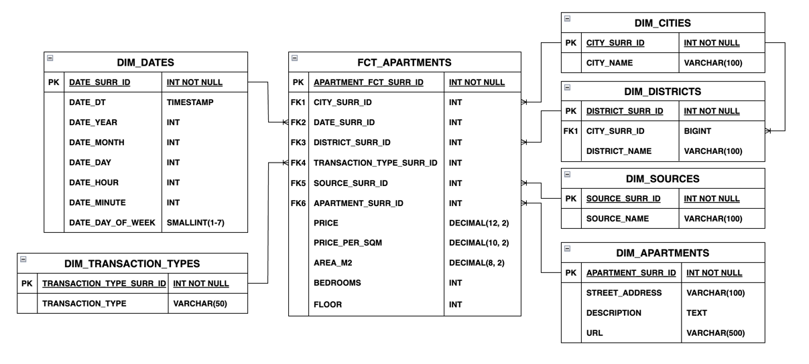

# Apartment Market Analytics and Price Prediction System for Georgia

## Table of Contents

1. [Overview](#overview)
2. [Features](#features)
3. [Technologies Used](#technologies-used)
4. [Data Collection & Description](#data-collection--description)
5. [Data Cleaning](#data-cleaning)
6. [Database](#database)
7. [Exploratory Data Analysis](#exploratory-data-analysis)
8. [Machine Learning](#machine-learning)
9. [System Implementation](#system-implementation)
10. [How To Run](#how-to-run)

## Overview

This project is a full-stack data analytics and machine learning system designed to analyze the Georgian apartment market and predict apartment sale and rental prices. The system combines automated data collection, data processing, exploratory data analysis, machine learning, and web-based visualization into a single platform.

Apartment listings are collected through web scraping from major Georgian real estate platforms and stored in a PostgreSQL database. The collected data is cleaned, transformed, and analyzed to identify market trends and pricing patterns across different cities and districts.

Several machine learning models are trained and evaluated for apartment price prediction, including Linear Regression, Decision Tree Regressor, Random Forest Regressor, and Hist Gradient Boosting Regressor. The best-performing model is integrated into the web application, allowing users to estimate apartment prices based on property characteristics and location.

The project was developed as a Bachelor's Capstone Project in Computer Science at Kutaisi International University.

## Features

* Automated apartment listing collection through Selenium web scraping
* Data storage and management using PostgreSQL
* Data cleaning and preprocessing pipeline
* Exploratory Data Analysis (EDA) with statistical visualizations
* Feature engineering for improved predictive performance
* Machine learning-based apartment sale price prediction
* Machine learning-based apartment rent price prediction
* Model evaluation and comparison using multiple regression algorithms
* Feature importance analysis
* REST API built with FastAPI
* Interactive frontend built with React and TypeScript
* Apartment price prediction interface for end users
* Market analytics dashboard with charts and visualizations

## Technologies Used

### Data Collection (Web Scraping)
- Selenium

### Data Processing & Cleaning
- Pandas

### Database
- PostgreSQL

### Exploratory Data Analysis (EDA)
- Matplotlib

### Machine Learning
- Scikit-learn

### Backend
- Python
- FastAPI

### Frontend
- React
- TypeScript
- Tailwind CSS
- Vite

## Data Collection & Description

### Data Description

The dataset was collected using automated web scraping from major Georgian real estate platforms, including home.ss.ge, livo.ge, and myhome.ge. It contains approximately 100,000 apartment listings from cities such as Tbilisi, Batumi, and Kutaisi, covering both sale and rental markets.

The data spans July 2025 to June 2026, enabling both cross-sectional and temporal market analysis. The target variable is **price (USD)**, used for predictive modeling.

Each record includes property characteristics, location details, and listing metadata.

| Feature | Description | Type |
|--------|-------------|------|
| URL | Link to original listing | Text |
| CITY | City of the property | Categorical |
| PRICE | Listing price (USD, target) | Numerical |
| PRICE_PER_SQM | Price per square meter | Numerical |
| DESCRIPTION | Property description | Text |
| DISTRICT_NAME | District or neighborhood | Categorical |
| STREET_ADDRESS | Address | Text |
| AREA_M2 | Apartment size (m²) | Numerical |
| BEDROOMS | Number of bedrooms | Numerical |
| FLOOR | Floor level | Numerical |
| UPLOAD_DATE | Listing date | Date |
| TRANSACTION_TYPE | Sale or rent | Categorical |
| SOURCE | Data source website | Categorical |

---

### Data Collection

Data was collected using automated web scraping with the **Selenium framework**, enabling interaction with dynamically loaded web pages.

The scraping system follows an object-oriented design:
- A base scraper defines the general pipeline
- Website-specific scrapers implement custom parsing and navigation logic

This modular structure allows easy extension to new sources while maintaining a unified workflow.

The scraper iterates through:
- Multiple cities
- Listing pages
- Transaction types (sale and rent)

To ensure reliability and performance, several optimizations were applied:
- Headless browser execution
- Disabled unnecessary resources (images, fonts)
- Random user-agent rotation
- Handling of timeouts and stale elements
- Error recovery for partial scraping failures

Extracted data is stored in **CSV format**, serving as input for data cleaning, database storage, and machine learning pipelines.

## Data Cleaning

The raw scraped dataset was unstructured and contained missing values, inconsistencies, and outliers. A preprocessing pipeline was implemented using **Pandas** to standardize and clean the data for analysis and machine learning.

---

### General Data Cleaning

Key transformations include:

- Removal of currency symbols and conversion of prices to a unified currency (USD)
- Standardization of numerical fields (area, bedrooms, floor)
- Conversion of `upload_date` into datetime format
- Extraction and normalization of categorical fields (district, transaction type)
- Handling missing or ambiguous district values using inference rules and mappings
- Feature consistency improvements across multiple data sources

---

### Data Filtering for EDA

Before exploratory analysis, additional filtering was applied:

- Removal of duplicate listings based on key attributes (price, area, location, etc.)
- Retention of the most recent record for duplicates
- Removal of missing critical values (price, area)
- Hard constraints on realistic ranges:
  - Area: 15–700 m²
  - Bedrooms: 1–10
  - Floor: up to 60
- Outlier removal using quantiles:
  - Price and price/m² filtered using 1st–99.5th percentiles
- City-level outlier filtering for more realistic regional distributions

---

### Data Cleaning for Machine Learning

A stricter preprocessing pipeline was applied for model training to prevent data leakage.

Key steps:

- Train-only computation of all filtering thresholds
- Deduplication using property attributes (not only URLs)
- Removal of rows with missing critical features
- Recalculation of `price_per_sqm` after cleaning
- Strict feature constraints:
  - Area: 15–500 m²
  - Bedrooms: 1–10
  - Floor: 1–60 + city-based percentile filtering

---

### Advanced Outlier Handling

- Global filtering of `price_per_sqm` using 2nd–99th percentiles
- City–district level IQR-based filtering
- Domain constraints:
  - Sale: 150–10,000 USD/m²
  - Rent: 2–100 USD/m²

---

After preprocessing, approximately:
- 14% of sale data
- 17% of rental data  
was removed due to noise and extreme outliers.

The final dataset is consistent, structured, and suitable for reliable machine learning modeling.

## Database

The cleaned apartment data is stored in a **PostgreSQL** database designed for analytical workloads. A **star schema architecture** is used to optimize querying and aggregation for data analysis and machine learning.

The schema consists of:
- One central fact table
- Multiple dimension tables

---

### Schema Design

**Fact Table**
- `fct_apartments` stores measurable attributes:
  - price
  - price_per_sqm
  - area_m2
  - bedrooms
  - floor
  - foreign keys to all dimensions

**Dimension Tables**
- `dim_cities` – city information
- `dim_districts` – district information linked to cities
- `dim_sources` – data source (scraping websites)
- `dim_transaction_types` – sale or rent type
- `dim_dates` – time-based attributes (day, month, year)
- `dim_apartments` – static listing data (URL, description, address)



---

### Design Characteristics

- Surrogate keys used as primary keys for all tables
- Foreign key constraints ensure referential integrity
- One-to-many relationships between dimensions and fact table
- City–district hierarchy preserved for geographic analysis

---

### Benefits

- Efficient aggregation for analytics (e.g., prices by city or time trends)
- Scalable structure for large datasets
- Clear separation of descriptive and numerical data
- Optimized for both EDA and machine learning workflows

## Exploratory Data Analysis (EDA)

EDA is performed to understand data distributions, relationships, and market patterns before model development. It helps identify trends, anomalies, and insights that guide feature engineering and model selection.

The analysis is implemented using:
- Pandas
- NumPy
- Matplotlib

---

### Analysis Focus Areas

The EDA is structured into the following components:

- **Market Overview**
  - Distribution of listings across cities
  - Breakdown of sale vs rent properties

- **Price Analysis**
  - Price distribution and variability
  - City-level affordability comparisons

- **Apartment Characteristics**
  - Impact of area, bedrooms, and floor on price
  - Structural property trends

- **Location Insights**
  - District-level price differences
  - Most expensive and most affordable areas

- **Time Analysis**
  - Listing volume over time
  - Price trends across the dataset period

---

## Machine Learning

A supervised regression pipeline is developed to predict apartment prices based on engineered features derived from preprocessing and feature engineering stages.

The system evaluates multiple models:
- Linear Regression
- Decision Tree Regressor
- Random Forest Regressor
- HistGradientBoosting Regressor

---

### Data Splitting Strategy

To simulate real-world conditions and prevent data leakage, a **time-based split** is used:

- 70% training
- 15% validation
- 15% testing

Data is sorted by `upload_date`, ensuring models are trained on past data and evaluated on future observations.

---

### Modeling Pipeline

The pipeline integrates preprocessing, feature engineering, and model training into a unified workflow:

- Categorical features → One-hot encoding
- Numerical features → Direct model input
- Target variable → Log transformation applied during training (inverse transformed for evaluation)

This improves stability and reduces skewness in price distribution.

---

### Model Training & Selection

Training follows a two-stage process:

1. Train models on the training set and tune hyperparameters using the validation set  
2. Retrain best configurations using combined training + validation data

Hyperparameter tuning is performed using grid search over predefined parameter ranges for tree-based models.

---

### Evaluation

Models are evaluated using:
- R² score (primary metric)
- Validation-based model selection
- Final evaluation on unseen test data

---

### Key Insights

- Ensemble models (Random Forest, Gradient Boosting) outperform linear models due to nonlinear relationships in pricing data
- Time-based splitting ensures realistic performance evaluation
- Log transformation of target improves model stability
- The pipeline is fully modular and reproducible

---

### Feature Importance (Random Forest)

Random Forest is used to analyze feature importance.

Key findings:
- **area_m2** is the most influential feature by a large margin
- **district_median_price_per_sqm** strongly captures location-based pricing effects
- Engineered features such as **area_per_bedroom** significantly improve prediction quality
- Location features (city, district, combined location) contribute moderately
- Temporal features (month, year) have relatively low impact

Overall, feature importance confirms that both structural and location-based engineered features significantly enhance prediction performance.

## System Implementation

The system is implemented as a full-stack web application that integrates machine learning models, backend services, and a modern frontend interface. It follows a **client-server architecture**, where the frontend communicates with the backend through REST APIs.

The platform enables users to:
- Explore real estate market analytics
- View visualized insights from EDA
- Generate real-time apartment price predictions

---

### Architecture Overview

The system consists of three main layers:

- **Frontend**: User interface and data visualization
- **Backend**: API layer and ML inference service
- **ML Pipeline**: Preprocessing, feature engineering, and prediction models

---

### Backend (FastAPI)

The backend is built using **FastAPI** and serves as the core service layer of the system.

#### Core responsibilities:
- Loading trained machine learning models
- Handling prediction requests
- Input validation using structured schemas
- Applying identical preprocessing and feature engineering used in training
- Serving analytical data and visualization outputs
- Providing metadata for dynamic frontend forms

#### API functionality:
- Retrieve prediction schema (form structure)
- Generate apartment price predictions
- Serve analytical results and charts

The backend ensures consistency between training and inference by reusing the same transformation pipeline, preventing discrepancies between model training and production behavior.

---

### Frontend (React + TypeScript + Tailwind CSS)

The frontend is developed using a modern component-based architecture.

#### Main pages:
- **Dashboard**
  - Displays EDA visualizations
  - Shows market trends, city/district comparisons, and statistical insights

- **Price Prediction**
  - Interactive form for user input:
    - Transaction type
    - City and district
    - Area (m²)
    - Bedrooms
    - Floor
    - Date
  - Sends request to backend API
  - Displays predicted price in real time

#### Key features:
- REST API integration with backend
- Responsive UI design (Tailwind CSS)
- Type safety and maintainability (TypeScript)
- Dynamic chart rendering for analytics

Here is a clean, **README-ready “How to Run” section** structured for clarity and reproducibility:


## How to Run

The project consists of two main pipelines:
1. Data pipeline (scraping → cleaning → database → EDA)
2. Machine learning pipeline (model training & evaluation)
3. Full-stack web application (backend + frontend)

---

### 1. Data Pipeline (Root `main.py`)

The main pipeline is located in the project root and executes the full data workflow:

- Web scraping (parallel execution using ThreadPoolExecutor)
- Data cleaning and transformation
- Database insertion (PostgreSQL)
- CSV export and deduplication
- Exploratory Data Analysis (EDA)

#### Run pipeline:
```
python main.py
```

### 2. Machine Learning Pipeline

The ML pipeline is located in:

```
/machine_learning/main.py
```

It is responsible for:

* Training regression models
* Hyperparameter tuning
* Model evaluation
* Saving trained models

#### Run ML pipeline:

```bash
python machine_learning/main.py
```

---

### 3. Backend (FastAPI)

The backend serves the trained model and API endpoints.

#### Run backend:

```bash
uvicorn backend.app.main:app --reload
```

Backend provides:

* Price prediction API
* Schema definitions for frontend forms
* Analytical data endpoints

---

### 4. Frontend (React + TypeScript + Vite)

The frontend provides the user interface for analytics and prediction.

#### Run frontend:

```bash
cd frontend
npm install
npm run dev
```

---

### Summary Workflow

1. Run `main.py` → collect & prepare data
2. Run ML pipeline → train models
3. Start backend → serve predictions
4. Start frontend → interact with system
